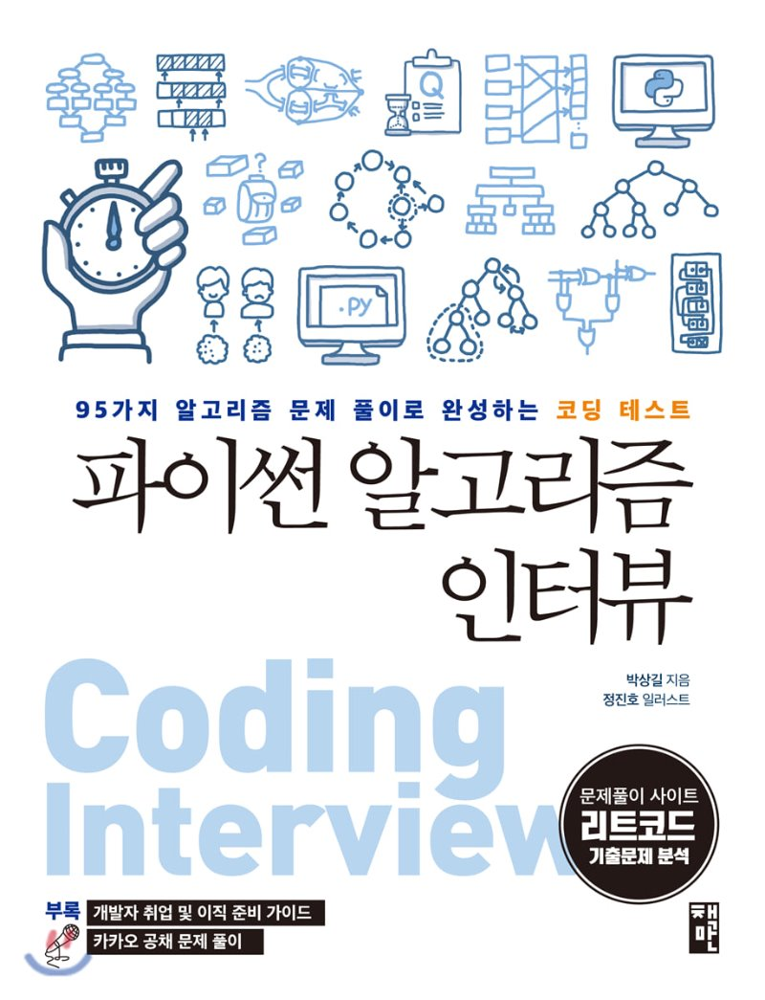

# Python Algorithm Interiew

- 파이썬 알고리즘 인터뷰(Python Algorithm Interiew)_ 박상길 

- ## 목차
|부|장|주제||
|-|-|-|-|
|1부|1|코딩인터뷰||
||1-1|코딩 인터뷰를 위한 온라인 테스트 플랫폼||
||1-2|국내 기업의 코딩 테스트 플랫폼 활용 현황||
||1-3|온라인 코딩 테스트의 사전 준비사항||
||1-4|화이트보드 코딩 인터뷰||
||2|프로그래밍 언어 선택||
||2-1|경진대회 통계로 알아본 언어 선호도||
||2-2|프로그래밍 언어별 특징||
||2-3|코딩 테스트에 최적인 프로그래밍 언어는?||
|2부|3|파이썬||
||3-1|파이썬에 대한 이해||
||3-2|파이썬 문법||
||3-3|코딩 스타일||
||4|빅오, 자료형||
||4-1|빅오||
||4-2|자료형||
||5|리스트, 딕셔너리||
||5-1|리스트||
||5-2|딕셔너리||
||6|문자열 조작||
||6-1||[문제]_01유효한 팰린드롬|
||6-2||[문제]_02문자열 뒤집기|
||6-3||[문제]_03로그 파일 재정렬|
||6-4||[문제]_04가장 흔한 단어|
||6-5|[문제]_05그룹 애너그램||
||6-6|여러 가지 정렬 방법||
||6-7||[문제]_06가장 긴 팰린드롬 부분 문자열|
||6-8|유니코드와 UTF-8||
|3부||선형 자료구조||
||7|배열||
||7-1||[문제]_07두 수의 합|
||7-2||[문제]_08빗물 트래핑|
||7-3||[문제]_09세 수의 합|
||7-4||[문제]_10배열 파티션 I|
||7-5||[문제]_11자신을 제외한 배열의 곱|
||7-6||[문제]_12주식을 사고팔기 가장 좋은 시점|
||8|연결 리스트||
||8-1||[문제]_13팰린드롬 연결 리스트|
||8-2||[문제]_14두 정렬 리스트의 병합|
||8-3||[문제]_15역순 연결 리스트|
||8-4||[문제]_16두 수의 덧셈|
||8-5||[문제]_17페어의 노드 스왑|
||8-6||[문제]_18홀짝 연결 리스트|
||8-7||[문제]_19역순 연결 리스트 II|
||9|스택, 큐||
||9-1|스택||
||9-2||__연결 리스트를 이용한 스택 ADT 구현|
||9-3||[문제]_20유효한 괄호|
||9-4||[문제]_21중복 문자 제거|
||9-5||[문제]_22일일 온도|
||9-6|큐||
||9-7||[문제]_23큐를 이용한 스택 구현|
||9-8||[문제]_24스택을 이용한 큐 구현|
||9-9||[문제]_25원형 큐 디자인|
||10|데크, 우선순위 큐||
||10-1|데크||
||10-2||[문제]_26원형 데크 디자인|
||10-3|우선순위 큐||
||10-4||[문제]_27k개 정렬 리스트 병합|
||11|해시 테이블||
||11-1|해시||
||11-2||__생일 문제|
||11-3||__비둘기집 원리|
||11-4||__로드 팩터|
||11-5||__해시 함수|
||11-6|충돌||
||11-7||__개별 체이닝|
||11-8||__오픈 어드레싱|
||11-9||__언어별 해시 테이블 구현 방식|
||11-10|[문제]_28해시맵 디자인||
||11-11|[문제]_29보석과 돌||
||11-12|[문제]_30중복 문자 없는 가장 긴 부분 문자열합||
||11-13|[문제]_31상위 K 빈도 요소||
|4부||비선형 자료구조||
||12|그래프||
||12-1|오일러 경로||
||12-2|해밀턴 경로||
||12-3|그래프 순회||
||12-4||__DFS(깊이 우선 탐색)|
||12-5||__BFS(너비 우선 탐색)|
||12-6|백트래킹||
||12-7|제약 충족 문제||
||12-8||[문제]_32섬의 개수|
||12-9||[문제]_33전화 번호 문자 조합|
||12-10||[문제]_34순열|
||12-11||[문제]_35조합|
||12-12||[문제]_36조합의 합|
||12-13||[문제]_37부분 집합|
||12-14||[문제]_38일정 재구성|
||12-15||[문제]_39코스 스케줄|

