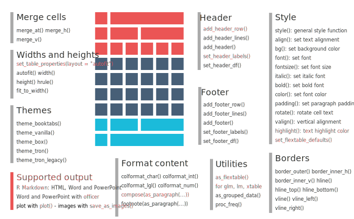

```{r setup, include=FALSE}
knitr::opts_chunk$set(echo = TRUE)
```

# Chapter 2 Design
## Table parts
플렉스테이블 객체는 세 부분으로 구성 
- 헤더 : 기본적으로 data.frame의 이름을 포함하는 헤더 행은 하나만 있다. 
- 본문 : body 부분은 data.frame의 데이터를 포함 
- 바닥글 : 바닥글 부분은 기본적으로 구현되지 않지만 캔에는 각주 또는 내용이 들어 있다. 
```{r}
ft <- flextable(head(airquality))
ft
```
부분은 새로운 라인으로 증강할 수 있다. 
```{r}
ft <- add_header_row(ft, values = c("air quality", "time"), colwidths = c(4, 2))
ft <- add_footer_lines(ft, "hello note")
ft
```

## 2.2 key columns
- col_keys 기능으로 플렉스테이블에 표시할 변수를 설정할 수 있다. 
```{r}
myft <- flextable(
  data = head(airquality),
  col_keys = c("Ozone", "Solar.R", "Wind", "Temp", "Month", "Day"))

myft
```
- col_keys 데이터 집합에 존재하지 않는 변수가 있으면 빈 열로 간주하여 구분자로 사용될 수 있다. 
```{r}
myft <- flextable(
  data = head(airquality),
  col_keys = c("Ozone", "Solar.R", "col1", "Month", "Day"))
myft
```
## 2.3  Cell content
- 셀의 표시된 내용은 쉽게 업데이트 될 수 있다. 
- 복합 콘텐츠(즉, 여러 조각으로 구성)를 만들 수도 있다. 
- 셀은 텍스트의 한 단락으로 만들어진다. 단락 다른 형식의 텍스트 청크를 여러 개 포함할 수 있다. 

```{r}
library(data.table)
library(dplyr)
library(flextable)
library(ggplot2)
```

```{r}
# data prep ----
z <- as.data.table(ggplot2::diamonds)
z <- z[, list(
  price = mean(price, na.rm = TRUE),
  list_col = list(.SD$x)
), by = "cut"]

# flextable ----
ft <- flextable(data = z) %>%
  compose(j = "list_col", value = as_paragraph(
    plot_chunk(value = list_col, type = "dens", col = "pink", 
               width = 1.5, height = .4, free_scale = TRUE)
  )) %>%
  colformat_double(big.mark = " ", suffix = " $") %>% 
  set_header_labels(box = "composite content", density = "density")
ft
```
## 2.4 Selectors 
### 2.4.1 Why selectors
- 선택기를 사용하여 작업이 발생해야 하는 행과열을 지정할 수 있다. 
- flextable의 기능에는 selectors가 있다. i 그리고 j: bg, bold, border, color, padding, fontsize, italic, align, compose, …
- 이것은 조건부 포맷을 매우 쉽게 만든다. 기본 데이터셋으로 사용 헤더 및 바닥글 부품을 사용할 수 있다. 
```{r}
dat <- head(ggplot2::diamonds, n = 10)
qflextable(dat) %>%
  color(~ price < 330, color = "orange", ~price + x + y + z ) %>%
  color(~ carat > .24, ~ cut, color = "red")
```
### 2.4.2 사용법 
- i 행 선택 및 j 열 선택은 다음과 같은 다양한 방법으로 표현될 수 있다.

#### 2.4.2.1 
- 사용 i = ~ col %in% "xxx" 모든 행을 선택하려면 'col' 열의 값은 "xxx"이다.
- 여러 조건을 표시하려면 & 또는 | 연산자를 사용
- i = ~ col1 < 5 & col2 %in% "zzz"
```{r}
ft <- qflextable(dat)

color(
  ft, i = ~ cut %in% "Premium",
  j = ~ x +  y, color = "red")
```
#### 문자 벡터
- col_key 를 포함하는 j 
```{r}
ft %>% 
  color(j = c("x", "y"), color = "orange", part = "all") %>%
  bold(j = c("price", "x"), bold = TRUE)
```
#### 2.4.2.3 정수 벡터
- 각 요소는 행 번호 또느 col_key 번호: 
```{r}
color(ft, i = 1:3, color = "orange")
```
#### 2.4.2.4 논리 벡터로서 
```{r}
color(ft, i = rep(c(TRUE, FALSE), 5), color = "orange")
```
### 2.4.3 Selectors and flextable parts
- 여러 작업(볼드, 색상, 패딩, 합성)수락 part = "all" 이 안에서 대소문자 모두 플랙서블의 각 부분에 적용하기 위한 평균이다. 
- 수직선을 추가한다
```{r}
library(officer)
```

```{r}
border <- fp_border()
vline(ft, j = c('clarity', 'price'), border = border, part = "all")
```
- 머리글 부분의 첫 번째 행에만 색상을 변경할 수 있다. 
```{r}
color(ft, i = 1, color = "red", part = "header")
```
- body 부분의 색상을 변경하는 것도 가능하다. 
```{r}
bg(ft, i = ~ price < 335,
   j = c('x', 'y', 'z'),
   bg = "orange", part = "body")
```
## 2.5 함수 맵 
- 다음 그림은 대부분의 기능을 보여주고 있다. 



